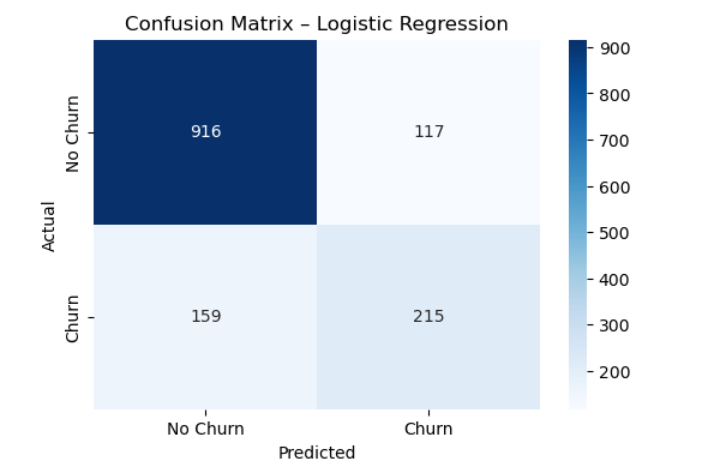
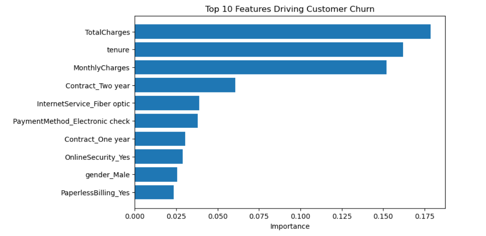

#  Customer Churn Prediction System

##  Project Overview

This project focuses on building a Customer Churn Prediction System using machine learning to identify customers who are likely to stop using a service.  
The goal is to help businesses take proactive retention actions by understanding churn drivers and predicting churn probability at the customer level.

This project was completed as **Machine Learning Task 2** under the **Future Interns Internship Program**.

---

##  Dataset Description

- **Dataset:** Telco Customer Churn Dataset  
- **Total Records:** 7,043 (7,032 after cleaning)  
- **Total Features:** 21 (20 after cleaning)  
- **Target Variable:** Churn (Yes / No)  

The dataset includes customer demographics, account details, service usage, payment methods, and billing information.

---

##  Tools & Technologies Used

- Python
- Pandas, NumPy
- Scikit-learn
- Matplotlib & Seaborn
- Jupyter Notebook

---

##  Project Workflow

### 1️. Data Cleaning & Preparation
- Converted TotalCharges to numeric
- Removed missing values
- Dropped non-predictive column (customerID)
- Encoded categorical variables using one-hot encoding

---

### 2️. Exploratory Data Analysis (EDA)

**Key observations:**
- 26.6% of customers churned
- Month-to-month contract customers showed the highest churn
- Churned customers had higher monthly charges
- Customers with low tenure were more likely to churn

---

### 3️. Feature Engineering
- One-hot encoding for categorical features
- Final feature matrix with 30 numeric features

---

### 4️. Model Building

Two classification models were trained and evaluated:
- Logistic Regression (final model)
- Random Forest (for comparison & feature importance)

---

### 5️. Model Evaluation (Logistic Regression – Final Model)

| Metric | Value |
|------|------|
| Accuracy | 80.4% |
| ROC-AUC | 0.836 |
| Churn Recall | 57% |

A confusion matrix was used to analyze prediction performance and misclassification risks.

---

### 6️. Feature Importance (Key Churn Drivers)

Top churn-driving factors identified:
- Total Charges
- Tenure
- Monthly Charges
- Contract Type
- Internet Service Type
- Payment Method

These features were visualized using Matplotlib.

---

### 7️. Churn Probability Scoring
- Predicted churn probability for individual customers
- Identified 83 high-risk customers (churn probability > 70%)
- Enables targeted retention strategies
  
---
##  Business Insights & Recommendations

- Customers on month-to-month contracts are most likely to churn
- Early-stage customers require retention attention
- High monthly charges increase churn risk
- Promoting long-term contracts can significantly reduce churn

---
##  Model Evaluation & Insights

###  Confusion Matrix – Logistic Regression


###  Top 10 Features Driving Customer Churn


---

##  Repository Structure

```text
FUTURE_ML_02/
│
├── data/
├── notebooks/
├── outputs/
├── screenshots/
└── README.md
```

---

##  Project Outcome

Built an end-to-end churn prediction system that:
- Identifies churn-prone customers
- Explains key churn drivers
- Provides actionable business insights

---

##  Internship Context

Completed as part of the **Future Interns – Machine Learning Internship**, demonstrating skills in:
- Classification modeling
- Model evaluation
- Business-oriented ML analysis
  
---

## Author

Guntur Ridhi

📧 gunturridhi@gmail.com

🔗 https://github.com/Ridhi-215

